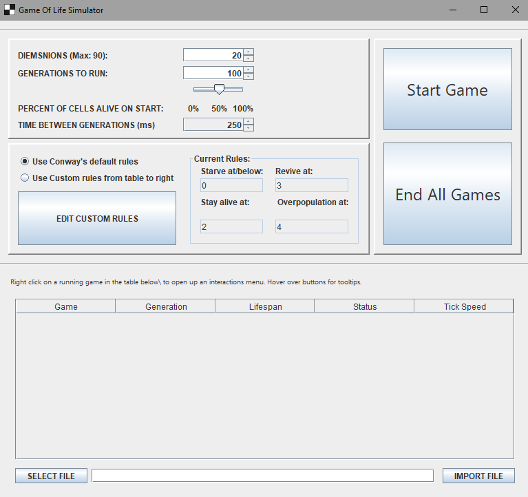
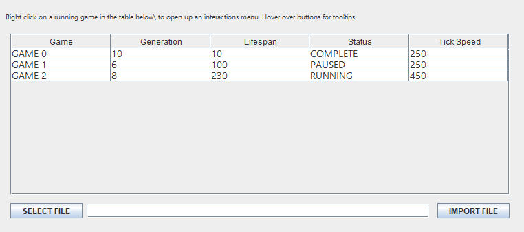
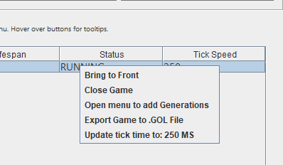

# Game Of Life

This project was intended to re-aquaint me with Java, and to practice multithreading.
It allows users to run multiple instances of Conway's Game of Life based on custom parameters, and to import and export these generated boards. 

## Authors

- [@evanleclair](https://github.com/Evandleclair)

## Requirements

This project was created using JDK 17, and so installing JDK 17 or newer or Java 8 or newer is recommended. 

https://www.java.com/en/download/

https://www.oracle.com/java/technologies/downloads/

### Notes on Logging System

The logging system will not function correctly on Mac OS based systems. The rest of the program should run correctly. 

## Features

- Supported by any platform that can run Java
- Set custom parameters and create boards that play out the game of life, with up to twenty simultaneous simulations possible. 
- Users can pause their simulations, click to create or kill cells, and then resume to watch the patterns play out. 
- Users can save interesting patterns and boards, and import them to be resumed later. 

# How to use the program:

## Part 1: the main window

When you start the program, you will be greeted by the main window.
We will go into these features in depth later. For now you simply need to know that the main window consists of:
1. A section where you can define the parameters for the simulation you want to run.
2. A section where you can see the current rules that are running the simulation, and choose your own.
3. A table listing all the current running games, which lists their name, their current generation, their generation at which they stop, their status, and the time between generations in miliseconds.
4. Two buttons:
  3A. The "Start Game" button creates a new Game of Life using the parameters and rules you defined in sections 1 and 2.
  3B. The "End All Games" button ends all running simulations. 

### Section 1: The parameters box.

Near the top of the main window is the parameters box, which controls how your simulations behave. There are several variables you can control here, that include
- Dimensions
The game board is always a square. You can set it's dimensions, in cells, here, up to a maximum of a 90x90 size board. 
- Generations To Run
You can adjust how many generations the simulation should initially run for here. The max value for initial generations is 10,000 but there is nothing preventing you from continuously adding more generations indefinitely. 
- Percent of Cells Alive on Start
This slider determines the chance for each individual cell to be alive when the game begins. Setting it to zero means the board will be a blank slate. Interestingly, due to a quirk in how Conway's Game of Life works, setting it to 100% will produce almost the same result as all but four cells will die of overpopulation on the first turn, followed by the four remaining survivors on the next turn. 
- Time Between Generations
This number lets you control the duration, in milliseconds, of each generation. 
### Section 2: The rules box.

By default, we use the rules laid out in Conway's Game of Life. However, if you would like to try changing these rules and seeing how they affect the patterns, you can select "Use Custom Rules..." and the program will use the custom rules stored in the table on the main window. 

To alter these rules, hit the button labeled "EDIT CUSTOM RULES", and the following window will appear: 

Where you can alter the rules used by the simulation. Make sure to hit "Confirm Custom Rules" or your changes will not be saved. If you want to use the default rules again, simply check  "Use Conway's default rules" on the main window. 

### Section 3: The game table.

All running games are visible in the "Game Table", along with their current generation, their lifespan, their current status, and the time between generations (also called "Tick Speed").

Right Click on a game to open a sub menu that lets you interact with the selected game. 

- Bring to Front: Focuses on the selected game and brings its cooresponding window to the front. 
- Close Game: Ends and closes the selected game. 
- Open Menu to Add Generations: Opens a popup where you can put in a number of generations to add to the games lifespan. 
- Export Game to .GOL File: Opens an interface where you can save the game in it's current state as a .GOL file to be imported and resumed later. 
- Update Tick Time to X ms: This changes the tick speed to match whatever the current value of the "Time Between Generations" section of the parameter box is set to. 
## Part 2: The Game Window

The game window consists of a grid of cells that play out a simulation according to the rules given to them. At any time, you can click on a living cell to kill it, or a blank cell to revive it. It is recommended that you pause the game before you do so, especially if you have set your tick speed to a low ammount of time. The text bar near the top tells you if the game is currently paused or not. 
### Section 1: The menu bar.

  Every simulation window has a menu bar, which contains options on how to interact with your simulation.
 Options include:
 - Pause/Resume: Pauses a game or resumes a paused game. Pausing makes it easier for the player to create patterns without having to worry about the tick speed between generations
 - Export Board: Opens a window that allows you to export the board in it's current state as a .GOL file. 
 - Clear Board: Kills all cells on the board, giving you a blank slate. 
 - Add Generations: Opens a pop up that lets you add additional generations to the game's lifespan. 
 - Close This Simulation: Ends game and closes the window. 
All of these options can be accessed even when the menu bar is closed by using the key combination shortcut listed next to them. 
### Section 2: Starting a Game
1. Set your parameters in the Parameter Box, and your custom rules (if you are using any). 
2. Click the "Start Game" button. A game window will appear, and your game will be brought to the front. 
### Section 3: Editing a game in progress.
  Once a game has been paused using the menu bar, you can revive and kill cells by clicking on them. Clicking on a live cell kills it, and clicking on a dead cell revives it. While it it possible to do this when the game is not paused as well, unless the generation time is very long the cells will usually die before you can give them enough neighbors to support themselves. 
## Part 3: Importing and Exporting Games.
### Section 1: Exporting a Gameboard
Games can be exported in their current state, to be re-imported later, as .GOL files. You can access this export menu in two ways.
1. By going to the Menu Bar (see Part 2, Section 1) and selecting "Export Board". 
2. By right clicking on a game in the games table (see Section 3) and choosing "Export Game to .GOL File"

A window will appear where you can name and save your gameboard as a file. 

### Section 2: Importing a Gameboard

Below the game table, there is a text box and two buttons, that looks like this:

gameoflifesim/src/main/resources/ReadMeResources/importBar.png

This can be used to import .GOL files as gameboards.

To import a gameboard, follow these steps:
1. Hit the "SELECT FILE" button on the left. A window will appear where you can select a .GOL file to load. 
2. If you picked a valid file, you will see it appear in the text bar between the two buttons.
3. Press "IMPORT FILE". A popup will appear, asking you how many generations you want your new gameboard to initially run for.
4. Once you confirm the generations to run it for, your game will appear on the game table, ready to go!
